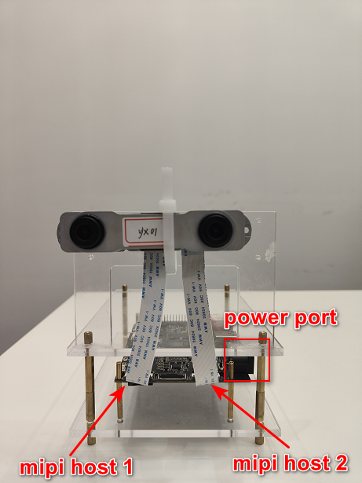
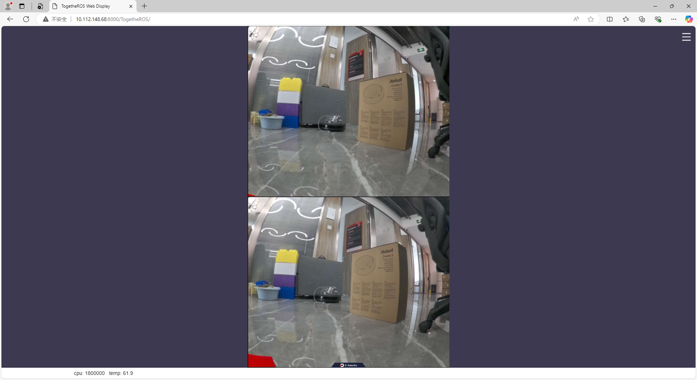
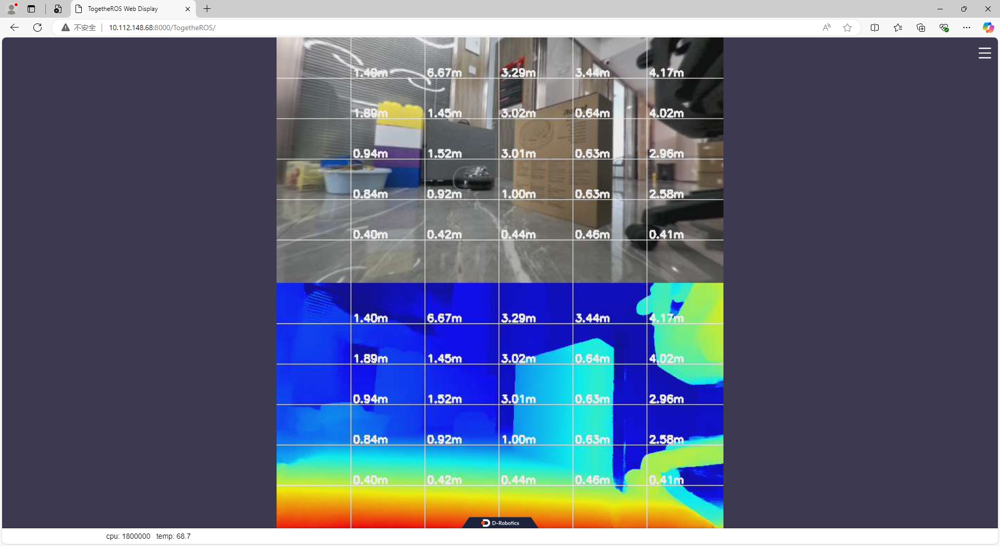

# hobot_s316_cam

## 描述

启动s316相机，并发布双目图像

## 编译

1. 交叉编译，在PC端执行

```shell
bash ./robot_dev_config/build.sh -p X5 -s hobot_s316_cam
```

## 运行

(0) 运行s316相机之前，需要满足3个条件：

- 按如图所示接线



- 将配置文件拷贝到运行目录

```shell
cp -rv hobot_s316_cam/config/cfg ./
```

- lib文件需要能被系统找到

```shell
# 方法1：将lib文件夹配置到环境变量
export LD_LIBRARY_PATH=${LD_LIBRARY_PATH}:./hobot_s316_cam/lib

# 方法2：将lib文件拷贝到/usr/lib目录下
cp -rv ./hobot_s316_cam/lib/* /usr/lib
```

一定要满足这3个条件再在运行目录（包含cfg文件夹的目录）运行以下命令，才能启动相机

(1) 发布双目图像

```bash
# 运行目录必须包含上面拷贝的cfg目录
ros2 launch hobot_s316_cam pub_stereo_imgs.launch.py
```

在浏览器输入[http://ip:8000](http://ip:8000)即可查看s316输出的双目图像



(2) 发布双目图像+地瓜双目算法

```bash
# 运行目录必须包含上面拷贝的cfg目录，并需要加载自定义标定文件，接线不要接反，导致左右图错误
ros2 launch hobot_s316_cam test_stereo_custom_rectify.launch.py \
stereonet_model_file_path:=./x5baseplus_alldata_woIsaac_yuv444.bin postprocess:=v2 \
stereo_calib_path:=./stereo_8.yaml
```

在浏览器输入[http://ip:8000](http://ip:8000)即可查看双目算法的结果



## 功能包参数

| 名称     | 默认值 | 说明                                                                                                         |
| -------- | ------ | ------------------------------------------------------------------------------------------------------------ |
| need_gdc | False  | 是否采用cfg目录下的gdc文件对图像进行矫正，需要注意每个相机的gdc文件是不一样的，需要替换cfg文件夹下的相应文件 |
